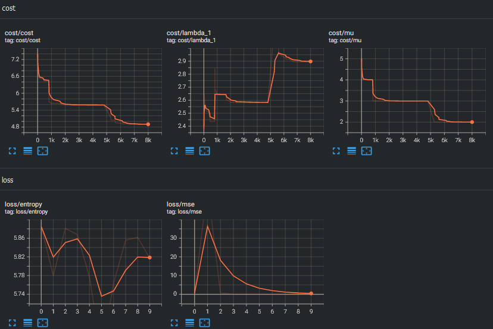

# AlphaZero discrete optimization

A project-focused experimental optimizer which optimizes over state spaces with limited prior knowledge through self-play. See the [Issues](https://github.com/ariasanovsky/azdopt/issues/) for planned features and optimizations.

The goal is to provide an API which makes it easier to set up data-parallel learning loops and to optimize searches by exploiting symmetries, with help from the trait system.

It combines ideas from the papers:

- [Constructions in combinatorics via neural networks](https://arxiv.org/abs/2104.14516), and
- [Alpha Zero](https://arxiv.org/pdf/1712.01815.pdf).

It mainly uses:

- [`dfdx`](https://docs.rs/dfdx/latest/dfdx/) for type-checked neural networks,
- [`rayon`](https://docs.rs/rayon/latest/rayon/) for data-parallel MCTS exploration,
- and is experimentally migrating data viz from `python` to [Tensorboard](https://www.tensorflow.org/tensorboard).

## Contributions

Feedback on a high-level API is welcome. Please make Github Issues before making PRs.

## Alpha Zero algorithm

Our first implementation can be summarized:

1. Our agents search trees in parallel.
2. During episodes, they seek to maximize the expected future improvement in cost function *over the entire search path*.
   1. They end each episodes when they visit new nodes.
   2. The neural network evaluates state vectors in batches.
   3. Each evaluation predicts the gain function and the agent's preference for actions from the new state.
3. Between episodes, we populate new nodes with their predictions and update nodes along the path.
4. Between epochs, we minimize cross entropy loss (priors' inaccuracy) and $L_2$ loss (gain prediction inaccuracy).
   1. Additionally, we select new roots from visited nodes.
   2. When stagnant, we generate new roots.

## States and Actions

We restrict our attention to state spaces with a finite number of dimensions whose actions are discrete and commonly enumerated. Our most thorough examples uses the `INTMinTree`, as demonstrated [here](https://github.com/ariasanovsky/azdopt/blob/main/graph-state/examples/06-c21.rs). Examples `01` through `04` have prototypes to re-implement similarly.

## Progress

The design of the MCTS and the formulation of `StateActionSpace` and the `INTMinTree`. All variants of the MCTS will be refactored with a similar design. It may be useful to create a CLI to alter hyperparameters during training.

## License

License

Dual-licensed.

Licensed under the [Apache License, Version 2.0](https://www.apache.org/licenses/LICENSE-2.0) or the [MIT license](https://opensource.org/licenses/MIT), at your option. This file may not be copied, modified, or distributed except according to those terms.
